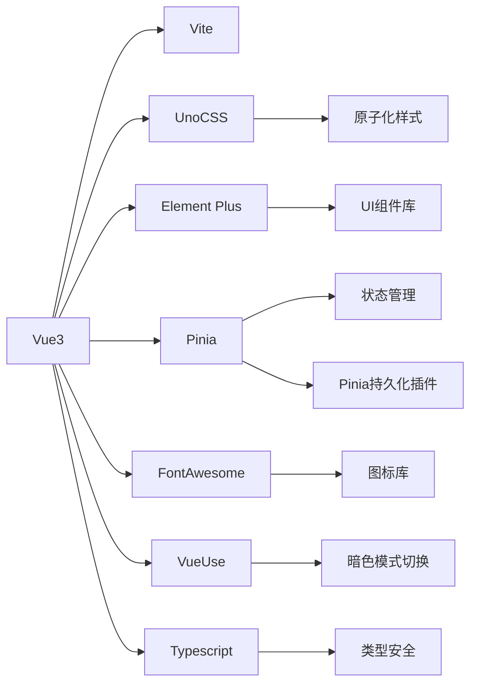
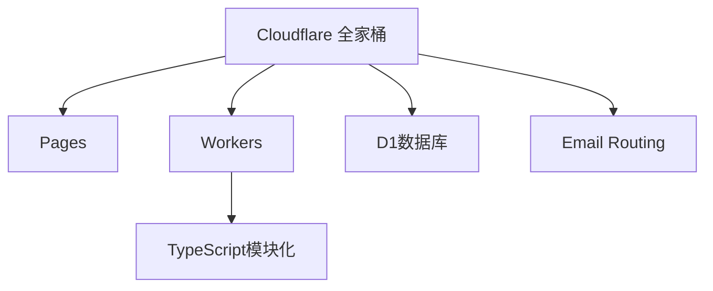
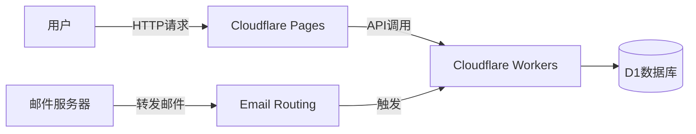
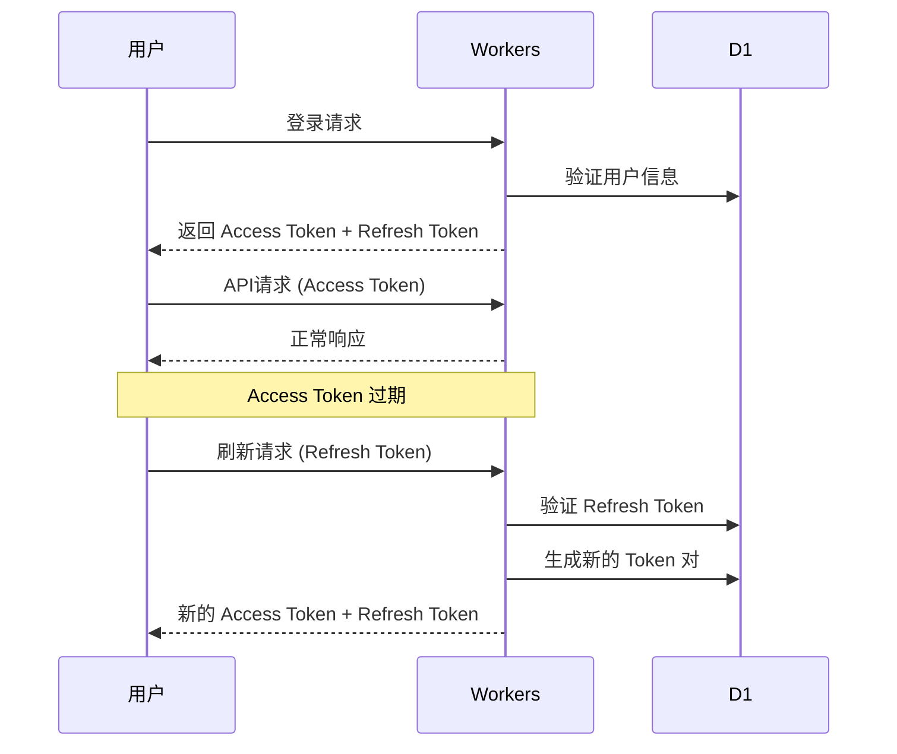
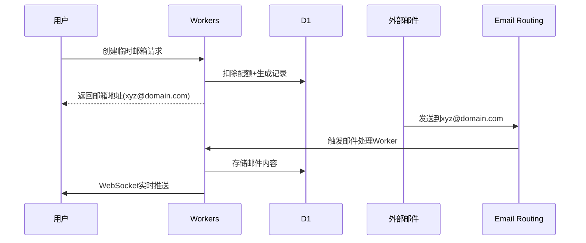

never edit this file

## 临时邮箱管理系统技术架构与需求文档

### 一、系统概述

基于 Cloudflare 全家桶的临时邮箱系统，提供一次性邮箱生成、邮件接收、配额管理等功能，支持多域名后缀选择。

---

### 二、技术架构

#### 前端架构



**技术栈详细说明：**
- **Vue 3**: 前端框架，使用 Composition API
- **Vite**: 构建工具
- **UnoCSS**: 原子化 CSS 框架，支持暗色模式
- **Element Plus**: UI 组件库，支持主题定制
- **Pinia**: 状态管理，替代 Vuex
- **Pinia 持久化插件**: 自动持久化状态到 localStorage/sessionStorage
- **FontAwesome**: 图标库，提供丰富的图标资源
- **VueUse**: Vue 组合式工具库，用于暗色模式切换
- **Typescript**: 类型安全，提升代码质量和维护性

#### 后端架构



**后端技术栈：**
- **Cloudflare Workers**: 边缘计算平台，支持 TypeScript
- **模块化设计**: 按功能拆分模块（auth、email、admin、utils）
- **TypeScript**: 类型安全，提升代码质量和维护性
- **D1 数据库**: SQLite 兼容的分布式数据库
- **Email Routing**: 邮件路由服务
- **Turnstile**: Cloudflare 人机验证，防止滥用和机器人攻击

#### 全栈架构图



---

### 三、数据库设计（D1 SQLite）

#### 表结构

```sql
-- 用户表
CREATE TABLE users (
  id INTEGER PRIMARY KEY,
  email TEXT UNIQUE NOT NULL, -- 用户邮箱（注册邮箱）
  password_hash TEXT NOT NULL,
  quota INTEGER DEFAULT 0,
  role TEXT DEFAULT 'user', -- 'user' | 'admin'
  is_active BOOLEAN DEFAULT 1,
  created_at TIMESTAMP DEFAULT CURRENT_TIMESTAMP,
  updated_at TIMESTAMP DEFAULT CURRENT_TIMESTAMP
);

-- 临时邮箱表
CREATE TABLE temp_emails (
  id INTEGER PRIMARY KEY,
  user_id INTEGER REFERENCES users(id),
  email TEXT UNIQUE, -- 完整邮箱地址
  domain_id INTEGER REFERENCES domains(id),
  created_at TIMESTAMP DEFAULT CURRENT_TIMESTAMP,
  active BOOLEAN DEFAULT 1
);

-- 域名表
CREATE TABLE domains (
  id INTEGER PRIMARY KEY,
  domain TEXT UNIQUE, -- example.com
  status INTEGER DEFAULT 1 -- 0=禁用 1=启用
);

-- 邮件表
CREATE TABLE emails (
  id INTEGER PRIMARY KEY,
  temp_email_id INTEGER REFERENCES temp_emails(id),
  sender TEXT,
  subject TEXT,
  content TEXT,
  received_at TIMESTAMP DEFAULT CURRENT_TIMESTAMP
);

-- 兑换码表
CREATE TABLE redeem_codes (
  code TEXT PRIMARY KEY,
  quota INTEGER,
  valid_until TIMESTAMP,
  used BOOLEAN DEFAULT 0
);

-- 操作日志表
CREATE TABLE logs (
  id INTEGER PRIMARY KEY,
  user_id INTEGER REFERENCES users(id),
  action TEXT, -- CREATE_EMAIL/DELETE_EMAIL/LOGIN/REGISTER
  ip_address TEXT,
  user_agent TEXT,
  timestamp TIMESTAMP DEFAULT CURRENT_TIMESTAMP
);

-- JWT 刷新令牌表
CREATE TABLE refresh_tokens (
  id INTEGER PRIMARY KEY,
  user_id INTEGER REFERENCES users(id),
  token_hash TEXT UNIQUE NOT NULL,
  expires_at TIMESTAMP NOT NULL,
  created_at TIMESTAMP DEFAULT CURRENT_TIMESTAMP,
  is_revoked BOOLEAN DEFAULT 0
);

-- API 限流表
CREATE TABLE rate_limits (
  id INTEGER PRIMARY KEY,
  identifier TEXT NOT NULL, -- IP地址或用户ID
  endpoint TEXT NOT NULL,   -- API端点
  request_count INTEGER DEFAULT 1,
  window_start TIMESTAMP DEFAULT CURRENT_TIMESTAMP,
  UNIQUE(identifier, endpoint, window_start)
);
```

---

### 四、核心功能模块

#### 1. 用户系统

**身份认证：**
- **双 Token 机制**：
  - Access Token：15天有效期，用于 API 访问
  - Refresh Token：30天有效期，用于刷新 Access Token
- **邮箱注册**：用户通过邮箱注册账号
- **注册表单**：邮箱、密码、确认密码
- **角色权限**：用户表中 role 字段区分普通用户和管理员

**配额管理：**
- 注册用户赠送 5 个配额
- 创建邮箱消耗 1 个配额
- 个人中心（邮箱列表/邮件查看）

**JWT Token 刷新流程：**


#### 2. 临时邮箱服务



#### 3. 管理后台

- 用户管理（禁用/配额调整）
- 域名管理（添加/启用/禁用）
- 邮件审查（查看所有邮件）
- 日志审计（操作记录）
- 兑换码生成（批量创建）

#### 4. 配额系统

- 兑换码兑换流程：

```
1. 用户输入兑换码
2. Workers验证有效性
3. D1更新用户配额
4. 标记兑换码已使用
```

---

### 五、Cloudflare Workers 模块化设计

#### 项目结构（TypeScript）

```
src/
├── modules/
│   ├── auth/
│   │   ├── auth.service.ts      # 认证服务
│   │   ├── jwt.service.ts       # JWT 服务
│   │   └── types.ts             # 认证相关类型
│   ├── email/
│   │   ├── email.service.ts     # 邮件服务
│   │   ├── parser.service.ts    # 邮件解析服务
│   │   └── types.ts             # 邮件相关类型
│   ├── admin/
│   │   ├── admin.service.ts     # 管理员服务
│   │   └── types.ts             # 管理员相关类型
│   └── shared/
│       ├── database.service.ts  # 数据库服务
│       ├── utils.ts             # 工具函数
│       └── types.ts             # 共享类型
├── handlers/
│   ├── auth.handler.ts          # 认证路由处理
│   ├── email.handler.ts         # 邮件路由处理
│   └── admin.handler.ts         # 管理员路由处理
├── middleware/
│   ├── auth.middleware.ts       # 认证中间件
│   ├── cors.middleware.ts       # CORS 中间件
│   ├── ratelimit.middleware.ts  # API 限流中间件
│   └── turnstile.middleware.ts  # Turnstile 验证中间件
└── index.ts                     # 主入口文件
```

#### 认证模块（TypeScript）

```typescript
// src/modules/auth/jwt.service.ts
export interface TokenPair {
  accessToken: string;
  refreshToken: string;
}

export interface JWTPayload {
  userId: number;
  email: string;
  role: 'user' | 'admin';
  type: 'access' | 'refresh';
}

export class JWTService {
  private readonly ACCESS_TOKEN_EXPIRES = 15 * 24 * 60 * 60; // 15天
  private readonly REFRESH_TOKEN_EXPIRES = 30 * 24 * 60 * 60; // 30天

  async generateTokenPair(user: User): Promise<TokenPair> {
    const accessToken = await this.generateAccessToken(user);
    const refreshToken = await this.generateRefreshToken(user);

    // 存储 refresh token 到数据库
    await this.storeRefreshToken(user.id, refreshToken);

    return { accessToken, refreshToken };
  }

  async refreshTokens(refreshToken: string): Promise<TokenPair | null> {
    // 验证 refresh token
    // 生成新的 token 对
    // 撤销旧的 refresh token
  }
}
```

#### 用户注册模块

```typescript
// src/modules/auth/auth.service.ts
export interface RegisterRequest {
  email: string;
  password: string;
  confirmPassword: string;
}

export class AuthService {
  async register(data: RegisterRequest): Promise<User> {
    // 1. 验证邮箱格式
    if (!this.isValidEmail(data.email)) {
      throw new Error('邮箱格式不正确');
    }

    // 2. 验证密码一致性
    if (data.password !== data.confirmPassword) {
      throw new Error('两次输入的密码不一致');
    }

    // 3. 检查邮箱是否已存在
    const existingUser = await this.getUserByEmail(data.email);
    if (existingUser) {
      throw new Error('邮箱已被注册');
    }

    // 4. 创建用户
    const passwordHash = await this.hashPassword(data.password);
    return await this.createUser({
      email: data.email,
      password_hash: passwordHash,
      role: 'user'
    });
  }
}
```

#### 邮箱服务模块

```typescript
// src/modules/email/email.service.ts
export class EmailService {
  async createTempEmail(userId: number, domainId: number): Promise<TempEmail> {
    // 检查配额
    // 生成随机邮箱前缀
    // 保存到D1
  }

  async receiveEmail(emailData: EmailData): Promise<void> {
    // 解析Email Routing转发内容
    // 存储邮件到D1
    // 实时推送给用户
  }
}
```

---

### 六、关键实现细节

#### 邮件接收流程

1. 在 Cloudflare 配置 Email Routing
2. 设置 Catch-all 地址指向 Worker
3. Worker 处理原始邮件：

```javascript
import PostalMime from "postal-mime";
// 邮件处理器
// 使用 postal-mime 解析邮件
async function parseEmailWithPostalMime(rawEmail) {
  try {
    const parser = new PostalMime();
    const email = await parser.parse(rawEmail);
    return email;
  } catch (error) {
    console.error("Email parsing error:", error);
    return {
      subject: "解析失败",
      text: "邮件解析失败",
      html: "",
      from: { address: "", name: "" },
    };
  }
}
function extractVerificationCode(content) {
  // 常见的验证码模式
  const patterns = [
    /验证码[：:\s]*([0-9]{4,8})/i,
    /verification code[：:\s]*([0-9]{4,8})/i,
    /code[：:\s]*([0-9]{4,8})/i,
    /pin[：:\s]*([0-9]{4,8})/i,
    /\b([0-9]{4,8})\b.*验证/i,
    /\b([0-9]{4,8})\b.*code/i,
    /您的验证码是[：:\s]*([0-9]{4,8})/i,
    /your verification code is[：:\s]*([0-9]{4,8})/i,
    /\b([0-9]{6})\b/g, // 6位数字（最常见的验证码格式）
  ];

  for (const pattern of patterns) {
    const match = content.match(pattern);
    if (match && match[1]) {
      return match[1];
    }
  }

  return null;
}


export async function handleEmailProcessing(message, env) {
  try {
    console.log("Processing email from:", message.from, "to:", message.to);

    // 使用 postal-mime 解析邮件
    const parsedEmail = await parseEmailWithPostalMime(message.raw);

    // 提取收件人邮箱地址
    const toEmail = message.to;
    console.log("Recipient email:", toEmail);

    // 提取邮件内容
    const subject = parsedEmail.subject || "无主题";
    const textContent = parsedEmail.text || "";
    const htmlContent = parsedEmail.html || "";

    // 提取发件人信息
    const fromAddress = parsedEmail.from?.address || message.from;
    const fromName = parsedEmail.from?.name || "";

    // 尝试提取验证码
    const verificationCode = extractVerificationCode(
      textContent + " " + htmlContent
    );
    // ...
  } catch (error) {
    console.error("Email processing error:", error);
  }
}
```

---

### 七、部署配置

#### wrangler.toml

```toml
name = "temp-email"
compatibility_date = "2024-03-01"

[[d1_databases]]
binding = "DB"
database_name = "email-db"
database_id = "xxxx-xxxx-xxxx"

[build]
command = "npm run build"

[env.production]
vars = {
  JWT_SECRET = "xxx",
  BASE_DOMAIN = "yourapp.com",
  TURNSTILE_SECRET_KEY = "xxx",
  TURNSTILE_SITE_KEY = "xxx"
}
```

---

### 八、前端状态管理设计

#### Pinia Store 结构

```typescript
// stores/auth.ts
export const useAuthStore = defineStore('auth', {
  state: () => ({
    user: null as User | null,
    accessToken: '',
    refreshToken: '',
    isAuthenticated: false
  }),

  actions: {
    async login(email: string, password: string) {
      // 登录逻辑
    },

    async refreshTokens() {
      // Token 刷新逻辑
    },

    logout() {
      // 清除状态和持久化数据
    }
  },

  persist: {
    key: 'auth-store',
    storage: localStorage,
    paths: ['accessToken', 'refreshToken', 'user']
  }
})

// stores/email.ts
export const useEmailStore = defineStore('email', {
  state: () => ({
    tempEmails: [] as TempEmail[],
    currentEmails: [] as Email[],
    quota: 0
  }),

  persist: {
    key: 'email-store',
    storage: sessionStorage,
    paths: ['quota']
  }
})
```

#### 暗色主题设计

```typescript
// stores/theme.ts
export const useThemeStore = defineStore('theme', {
  state: () => ({
    isDark: false,
    theme: 'light' as 'light' | 'dark' | 'auto'
  }),

  actions: {
    toggleTheme() {
      this.isDark = !this.isDark;
      this.theme = this.isDark ? 'dark' : 'light';
      this.applyTheme();
    },

    setTheme(theme: 'light' | 'dark' | 'auto') {
      this.theme = theme;
      if (theme === 'auto') {
        this.isDark = window.matchMedia('(prefers-color-scheme: dark)').matches;
      } else {
        this.isDark = theme === 'dark';
      }
      this.applyTheme();
    },

    applyTheme() {
      document.documentElement.classList.toggle('dark', this.isDark);
      // Element Plus 主题切换
      document.documentElement.setAttribute('data-theme', this.isDark ? 'dark' : 'light');
    }
  },

  persist: {
    key: 'theme-store',
    storage: localStorage,
    paths: ['theme']
  }
})
```

#### FontAwesome 图标使用

```vue
<!-- 在组件中使用 FontAwesome 图标 -->
<template>
  <div class="email-item">
    <font-awesome-icon :icon="['fas', 'envelope']" class="text-blue-500 dark:text-blue-400" />
    <font-awesome-icon :icon="['fas', 'trash']" class="text-red-500 dark:text-red-400" />
    <font-awesome-icon :icon="['fas', 'copy']" class="text-gray-500 dark:text-gray-400" />
    <!-- 主题切换按钮 -->
    <button @click="themeStore.toggleTheme()" class="theme-toggle">
      <font-awesome-icon :icon="themeStore.isDark ? ['fas', 'sun'] : ['fas', 'moon']" />
    </button>
  </div>
</template>

<script lang="ts" setup>
import { useThemeStore } from '@/stores/theme'
const themeStore = useThemeStore()
</script>
```

### 九、安全设计与 API 限流

#### 核心安全机制

1. **双 Token JWT 认证**：
   - Access Token 短期有效（15天）
   - Refresh Token 长期有效（30天）
   - 自动刷新机制，提升安全性
2. **配额校验**：创建邮箱时原子操作校验
3. **邮件隔离**：用户只能访问自己的邮件
4. **角色权限**：基于用户表 role 字段的权限控制
5. **操作审计**：所有敏感操作记录日志（包含 IP 和 User-Agent）
6. **密码安全**：使用 bcrypt 等安全哈希算法
7. **邮箱验证**：注册时验证邮箱格式和唯一性

#### API 限流 + Turnstile 防护策略

**需要 Turnstile 验证的接口：**
- ✅ **用户注册** (`POST /api/auth/register`)
- ✅ **用户登录** (`POST /api/auth/login`)
- ✅ **创建临时邮箱** (`POST /api/email/create`)
- ✅ **兑换码使用** (`POST /api/redeem`)

**API 限流规则：**

```typescript
// src/middleware/ratelimit.middleware.ts
export interface RateLimitRule {
  endpoint: string;
  windowMs: number;    // 时间窗口（毫秒）
  maxRequests: number; // 最大请求数
  requireAuth: boolean; // 是否需要认证
  requireTurnstile: boolean; // 是否需要 Turnstile
}

export const RATE_LIMIT_RULES: RateLimitRule[] = [
  // 注册限流：每小时最多 3 次
  {
    endpoint: '/api/auth/register',
    windowMs: 60 * 60 * 1000,
    maxRequests: 3,
    requireAuth: false,
    requireTurnstile: true
  },

  // 登录限流：每 15 分钟最多 5 次
  {
    endpoint: '/api/auth/login',
    windowMs: 15 * 60 * 1000,
    maxRequests: 5,
    requireAuth: false,
    requireTurnstile: true
  },

  // 创建邮箱限流：每分钟最多 10 次
  {
    endpoint: '/api/email/create',
    windowMs: 60 * 1000,
    maxRequests: 10,
    requireAuth: true,
    requireTurnstile: true
  },

  // 兑换码限流：每小时最多 10 次
  {
    endpoint: '/api/redeem',
    windowMs: 60 * 60 * 1000,
    maxRequests: 10,
    requireAuth: true,
    requireTurnstile: true
  },

  // 一般 API：每分钟最多 60 次
  {
    endpoint: '/api/*',
    windowMs: 60 * 1000,
    maxRequests: 60,
    requireAuth: true,
    requireTurnstile: false
  }
];
```

#### Turnstile 验证实现

```typescript
// src/middleware/turnstile.middleware.ts
export class TurnstileService {
  async verifyToken(token: string, remoteIP: string): Promise<boolean> {
    const response = await fetch('https://challenges.cloudflare.com/turnstile/v0/siteverify', {
      method: 'POST',
      headers: { 'Content-Type': 'application/json' },
      body: JSON.stringify({
        secret: env.TURNSTILE_SECRET_KEY,
        response: token,
        remoteip: remoteIP
      })
    });

    const result = await response.json();
    return result.success;
  }
}
```

---

### 十、扩展性设计

1. **邮件清理**：定时 Worker 删除 7 天前的邮件
2. **配额回收**：24 小时未激活邮箱返还配额
3. **模块化架构**：TypeScript 模块化设计，便于维护和扩展
4. **状态持久化**：Pinia 持久化插件自动管理前端状态
5. **图标系统**：FontAwesome 提供统一的图标体验
6. **主题系统**：支持明暗主题切换，跟随系统设置
7. **安全防护**：多层 API 限流 + Turnstile 人机验证

### 十一、前端 UnoCSS 暗色模式配置

```typescript
// uno.config.ts
import { defineConfig, presetUno, presetAttributify } from 'unocss'

export default defineConfig({
  presets: [
    presetUno(),
    presetAttributify()
  ],

  // 暗色模式配置
  darkMode: 'class', // 使用 class 策略

  theme: {
    colors: {
      // 自定义颜色变量，支持明暗模式
      primary: {
        50: '#eff6ff',
        500: '#3b82f6',
        600: '#2563eb',
        900: '#1e3a8a'
      }
    }
  },

  shortcuts: {
    // 常用的明暗模式样式快捷方式
    'bg-base': 'bg-white dark:bg-gray-900',
    'text-base': 'text-gray-900 dark:text-gray-100',
    'border-base': 'border-gray-200 dark:border-gray-700',
    'card-base': 'bg-white dark:bg-gray-800 border border-gray-200 dark:border-gray-700'
  }
})
```


wrangler pages deploy dist --project-name temp-mail-frontend

wrangler deploy --config wrangler.toml --env production

client id
Ov23liMbRVOzZ5igeF1M


client secrets
2fffc1c362e84ad5e5b8f7ad6801d9b7b8b52268