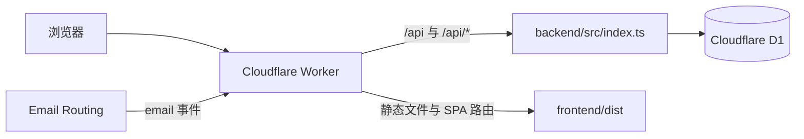

# 临时邮箱系统

基于 Vue 3、Cloudflare Workers、Workers Static Assets、D1 与 Email Routing 的临时邮箱系统。前端、HTTP API 与邮件处理入口由同一个 Worker 发布，不再维护 Cloudflare Pages 和独立 API Worker 两套部署。

## 部署架构


```mermaid
flowchart LR
  Browser[浏览器] --> Worker[Cloudflare Worker]
  Worker -->|/api 与 /api/*| API[backend/src/index.ts]
  Worker -->|静态文件与 SPA 路由| Assets[frontend/dist]
  API --> D1[(Cloudflare D1)]
  Routing[Email Routing] -->|email 事件| Worker
```

根目录的 `wrangler.toml` 是唯一部署配置：

- Worker 入口为 `backend/src/index.ts`。
- 静态资源目录为 `frontend/dist`。
- `/api` 与 `/api/*` 始终先进入 Worker，未知 API 也会返回 JSON 错误，不会落到前端页面。
- `/public-inbox` 也先进入 Worker，以附加禁止索引、禁止 Referer 和禁止缓存的隐私响应头。
- 其他不存在的路径回退到 `index.html`，支持 Vue Router history 模式。
- 绝大多数静态文件由 Cloudflare 直接响应；只有公开收件箱页面先经过 Worker 附加隐私响应头，再由 `ASSETS` binding 返回。

## 环境要求

- Node.js `20.19+` 或 `22.12+`
- npm 10+
- 已登录的 Cloudflare 账号
- 一个 D1 数据库
- 如需收信或发信，已配置 Email Routing

## 安装

```bash
npm ci
```

项目使用 npm workspaces 管理 `frontend` 与 `backend`。请从仓库根目录执行构建、开发和部署命令。

## 全新部署

新实例使用 [wrangler.example.toml](wrangler.example.toml) 填写自己的域名与数据库绑定，再用 **[backend/init.sql](backend/init.sql)** 一次性初始化空 D1 数据库：

```bash
npm run db:init
```

SQL 包含全部表、索引、触发器和迁移基线，不包含现有账户、域名或密钥。新管理员通过初始化接口创建，系统名称、价格等使用服务端默认内容并可在后台维护。

完整的安装顺序、Cloudflare 配置、管理员初始化和收信验证见 **[全新部署指南](docs/DEPLOYMENT.md)**。已有实例继续使用下方数据库迁移流程。

## 配置

### Wrangler 公共配置

部署前检查根目录 `wrangler.toml` 中的非敏感配置：

- `FRONTEND_DOMAIN`：正式站点域名，不包含协议；用于站点链接、跨源校验与固定的 GitHub 授权回调地址。
- `database_name`、`database_id`：目标 D1 数据库。
- `migrations_dir`：保持为 `backend/migrations`。

不要把密码、JWT、Turnstile Secret Key 或 GitHub Client Secret 写入 `wrangler.toml`。

### 服务端密钥

生产环境至少需要配置 JWT 基础密钥。首次部署还需要一个独立的、至少 32 字符的管理员初始化令牌：

```bash
npx wrangler secret put JWT_SECRET
npx wrangler secret put ADMIN_SETUP_TOKEN
```

两个值必须随机生成且不能相同。`JWT_SECRET` 同时保护登录令牌和后台保存的敏感系统配置，不应频繁更换；确需轮换时，应先规划现有会话失效与敏感设置重新保存。`ADMIN_SETUP_TOKEN` 只用于首次创建管理员，初始化后应立即删除或轮换。

本地开发复制示例文件，并只在未跟踪的 `.dev.vars` 中填写本地值：

```bash
cp .dev.vars.example .dev.vars
```

`.dev.vars` 已被 Git 忽略。示例中的占位值不能用于生产。

### 首次创建管理员

完成数据库初始化或升级并部署后，先确认是否需要初始化管理员：

```bash
curl https://你的统一域名/api/auth/bootstrap-status
```

当响应中的 `required` 为 `true` 时，调用一次初始化接口。请求中的 `setupToken` 必须与 `ADMIN_SETUP_TOKEN` Secret 完全一致，管理员密码至少 8 位：

```bash
curl https://你的统一域名/api/auth/bootstrap \
  --request POST \
  --header 'Content-Type: application/json' \
  --data '{
    "setupToken": "替换为至少32字符的一次性初始化令牌",
    "username": "admin",
    "email": "admin@example.com",
    "password": "替换为高强度管理员密码",
    "confirmPassword": "替换为高强度管理员密码"
  }'
```

成功后确认账号密码可以登录，再移除一次性 Secret：

```bash
npx wrangler secret delete ADMIN_SETUP_TOKEN
```

初始化接口在已有有效管理员后会拒绝再次创建，不能用来绕过后台管理员管理规则。

### 后台系统设置

以下运行时能力由管理员在后台“系统设置”中配置，不再通过前端构建变量或 Wrangler 明文变量固化：

- 站点设置：站点信息、配额策略、价格套餐和常见问题，各分组独立保存。
- 价格套餐支持维护权益、按钮文字与跳转链接；套餐和常见问题分别保存，互不提交对方的草稿。
- 账号与安全：账号与访问、第三方登录、人机验证，各分组独立保存。
- 人机验证支持总开关、站点密钥、验证密钥，以及登录、注册、兑换配额、公开收件箱的独立场景开关。
- GitHub 登录支持应用标识、应用密钥，授权回调地址由站点域名固定生成。

敏感字段写入后只显示掩码。关闭注册后，前端隐藏注册入口，注册 API 同时拒绝请求；关闭 GitHub 或 Turnstile 后，对应前端入口与服务端校验也会同步关闭。

GitHub OAuth Application 的 callback URL 应设置为：

```text
https://你的统一域名/api/auth/github/callback
```

回调地址由 `FRONTEND_DOMAIN` 自动生成，后台只读展示并支持复制。将这个地址填入 GitHub OAuth App 的 Authorization callback URL；旧的手动回调配置不再生效。通过兼容 API 域名发起登录时，会先跳转到正式站点再开始授权。

## 数据库初始化与升级

全新空库导入一份完整 SQL：

```bash
npm run db:init:local # 本地
npm run db:init       # 远程
```

这两个初始化命令二选一对应目标环境，且只执行一次。初始化脚本有空库保护，会拒绝已有应用表或迁移记录的数据库。

已有实例升级使用迁移命令。本地 D1：

```bash
npm run db:migrate:local
```

生产 D1：

```bash
npm run db:migrate
```

两个脚本都通过稳定的 `DB` binding 定位 `wrangler.toml` 中配置的数据库。部署新代码前先备份生产数据库，再应用迁移。

维护者新增迁移后运行 `npm run db:schema` 更新完整 SQL，运行 `npm run db:check` 验证完整结构、约束和迁移一致性。这两个维护命令使用 Python 3；部署预生成的 SQL 不需要 Python。

如果旧实例由历史初始化脚本创建，表中已有业务数据但 `d1_migrations` 为空，不能直接重放 0001-0013。先核对并执行带结构保护的基线脚本，再应用后续迁移：

```bash
npx wrangler d1 execute DB --remote \
  --file backend/scripts/baseline-legacy-d1.sql
npm run db:migrate
```

基线脚本只接受旧版 `code` 主键、`redeem_code_usage` 单数表且已具备公开收件箱与配额表的完整旧结构；空库、部分升级或已有迁移记录的数据库会校验失败，不会被误标记。

迁移完成后，请在后台“域名管理”确认至少有一个已由 Cloudflare Email Routing 接管的启用域名。示例域名不可直接用于生产收信。

## 本地开发

```bash
npm run dev
```

该命令先构建前端，再由一个本地 Worker 在 `http://localhost:8787` 同时提供静态页面与 API。它使用本地 D1，除非显式传入 `--remote`，否则不会访问生产数据库。

如只需重新生成前端资源：

```bash
npm run build:frontend
```

## 构建与部署

完整构建：

```bash
npm run build
```

该命令会构建 Vue 应用并对 Worker TypeScript 执行无输出类型检查。Worker 最终打包由 Wrangler 完成，不存在嵌套的 Wrangler build 命令。

唯一的生产部署命令：

```bash
npm run deploy
```

它按顺序执行完整构建，然后一次性上传 Worker 代码与 Static Assets。仓库不再提供 `deploy:frontend`、`deploy:backend` 或 `wrangler pages deploy`。

提交前可进行不上传的部署校验：

```bash
npm run build
npx wrangler deploy --dry-run
```

### 绑定统一域名

新实例模板通过 `routes` 中的 `custom_domain = true` 自动绑定站点域名。也可在 Cloudflare Dashboard 的 Worker 设置中管理 Custom Domain。前端和 API 使用同一个源，例如：

```text
https://mail.example.com/
https://mail.example.com/api/health
```

不再为 API 单独维护 `api.example.com`。如果保留旧 API 域名用于过渡，应仅做兼容转发，并在客户端全部升级后再移除。

Email Routing 的 Catch-all/路由目标也应指向这个 Worker，因为同一入口同时导出了 `fetch` 与 `email` 处理器。

根配置还包含每天一次的 Cron Trigger，用于物理清理超过 7 天的邮件、超过 30 天的安全审计与操作日志、已停用邮箱、过期令牌与陈旧限流记录，并把历史收件箱裁剪到最近 50 封、约 4 MiB 内容以内。超过 7 天的邮件会先在所有读取接口中立即隐藏，物理数据在下一轮清理任务中删除。配额流水是账户账本，不属于 30 天日志清理范围。不要在 Dashboard 中删除该触发器，否则数据保留策略无法兑现。

## 从 Pages + Worker 迁移

建议按以下顺序迁移，避免误删数据绑定：

1. 备份 D1，并确认根 `wrangler.toml` 仍绑定原数据库和 Email Routing。
2. 配置 `JWT_SECRET` 与一次性的 `ADMIN_SETUP_TOKEN`，应用最新 D1 migrations。
3. 执行 `npm run deploy`，通过已配置的域名验证首页、深层路由与 `/api/health`；默认配置不开放 Workers Preview URL。
4. 调用 bootstrap 接口创建管理员，验证登录后删除 `ADMIN_SETUP_TOKEN`。
5. 从旧 Pages 项目移除前端自定义域名，再把该域名绑定到统一 Worker。
6. 检查可收信域名、GitHub callback URL、Email Routing 目标与后台系统设置。
7. 确认生产流量正常后，再删除旧 Pages 项目和不再使用的旧 API 路由；不要删除 D1 数据库。

过去提交到配置文件或 Git 历史中的密钥都应视为已经泄露。迁移后请轮换 JWT、Turnstile 与 GitHub OAuth 密钥，并撤销旧值。仅从当前文件删除明文不能使旧密钥重新安全。

## 常用检查

```bash
# Worker 与静态资源配置语法、打包检查（不会部署）
npx wrangler deploy --dry-run

# 后端类型检查
npm run type-check:backend

# 查看本地健康检查
curl http://localhost:8787/api/health
```

## 目录说明

```text
.
├── backend/init.sql     # 全新部署的完整数据库 SQL
├── backend/migrations/  # 已有实例的升级迁移
├── backend/src/         # Worker API 与邮件处理
├── docs/DEPLOYMENT.md    # 新实例部署与交付指南
├── frontend/            # Vue 应用
├── package.json         # 单入口构建、开发与部署脚本
├── wrangler.example.toml # 新实例部署配置模板
└── wrangler.toml        # 唯一 Cloudflare 部署配置
```
